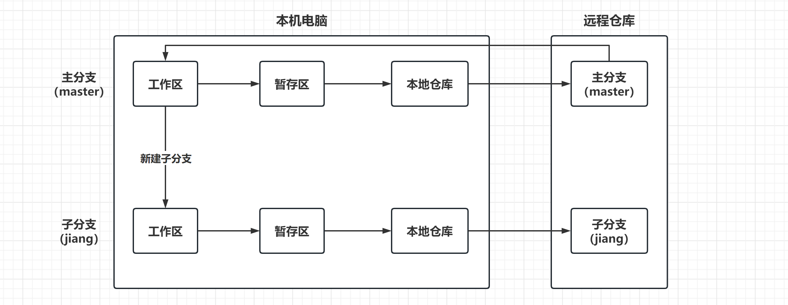
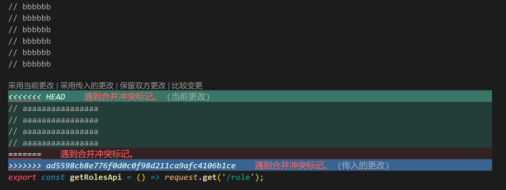

# Git准备工作

## 一、安装 Git

### 1、查看 Git 版本

```
git --version# git version 2.34.1.windows.1
```

### 2、安装 Git

Git 下载地址：`https://registry.npmmirror.com/binary.html?path=git-for-windows/`。

Git 在安装时，全部采用默认配置，直接全部【下一步】安装即可。

## 二、初始化配置

Git 初始化配置，就是需要设置自己的用户名和邮箱。是为了方便后续项目开发过程中，记录每一个操作与操作人的信息。

Git 初始化配置分为两种情况：

1. 全局配置：作用于电脑中所有的 Git 仓库；
2. 局部配置：作用于当前的 Git 仓库；

### 1、全局配置

```
git config --global user.name "jianglan"git config --global user.email "jianglan@qq.com"
```

### 2、局部配置

将 Git 的终端路径，定位到项目到根目录：

```
git config user.name "jianglan"git config user.email "jianglan@qq.com"
```

## 三、克隆远程仓库

一般情况下，我们接手的都是一个已经创建好仓库的项目了。所以可以直接拿到仓库地址，执行以下命令将项目克隆到本地：

```
git clone https://gitee.com/ihavenocat/red-rabbit.git
```

项目下载到本地后，需要自己单独执行 `npm i` 命令，来下载项目所有的依赖包。

# Git使用流程

02 -《Git 使用流程》- WEB27



后续 Git 所有的操作，都需要在终端中，将路径定位到仓库根目录（后面有 `(master)`）。


## 一、新建分支

```
git checkout -b jianglan
```

该命令执行完成后，会自动创建一个子分支，同时，会将主分支（master）的代码，复制一份到新建的子分支中。

## 二、项目开发

在项目的开发过程中，建议每做完一个小功能，就将代码进行保存。

### 1、暂存代码

将项目中所有发生改变的文件，进行暂时存储。

```
git add .
```

### 2、提交代码

将暂时存储的文件，保存到本地仓库。

```
git commit -m "操作日志"
```

执行完以上两个命令后，在本地日志中就有了提交记录，后续才能进行回退的选择。

### 3、上传代码

将本地仓库的代码，上传到远程的仓库。

```
git push origin jianglan
```

## 三、合并代码

当我们自己在子分支中，将一个完整的功能开发完成后，就需要将自己的代码合并到主分支中，共享出去供其他组员使用。

### 1、切换分支

在本地，从子分支切换到主分支：

```
git checkout master
```

### 2、合并分支

将本地子分支的代码，合并到本地主分支：

```
git merge jianglan
```

### 3、拉取代码

将远程主分支的代码，拉取到本地主分支：

```
git pull
```

以上步骤完成后，才算是在本地主分支中，将自己的代码和组员的代码实现了合并。

### 4、上传代码

将本地主分支合并完成后的代码，全部上传到远程的主分支：

```
git push
```

## 四、继续开发

继续开发时，我们需要在本地切换回自己的子分支。

### 1、切换分支

```
git checkout jianglan
```

### 2、合并代码

将本地主分支的代码，再合并到本地子分支：

```
git merge master
```

### 3、上传代码

将本地子分支的代码，上传到远程子分支：

```
git push origin jianglan
```

这一步完成后，我们才算是将本地主分支、子分支，远程主分支、子分支的代码统一了。

后续，可以继续写代码进行下一个功能的开发了。

# Git错误处理

## 一、冲突处理

当多个人同时操作同一个文件时，可能会出现以下冲突：



出现以上冲突后，需要自己手动解决冲突，删除无用的代码。

解决完成后，需要重新执行以下命令来保存代码：

```
git add .git commit -m "操作日志"
```

执行完成后，就可以将本地的代码重新上传到远程：

```
git push
```

## 二、版本回退

### 1、查看提交记录

```
git log
```

如果提交记录太多，可以直接输入 `:q` 退出记录列表。

### 2、回退版本

```
git reset --hard 26d07a6c0a75bf93ef067a84f4a5c4dceed64aa8
```