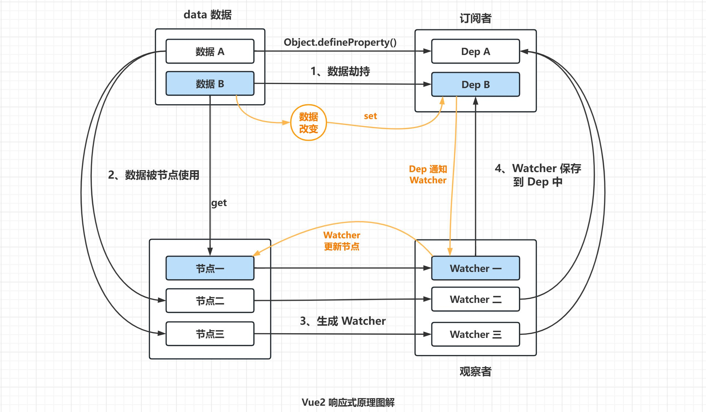
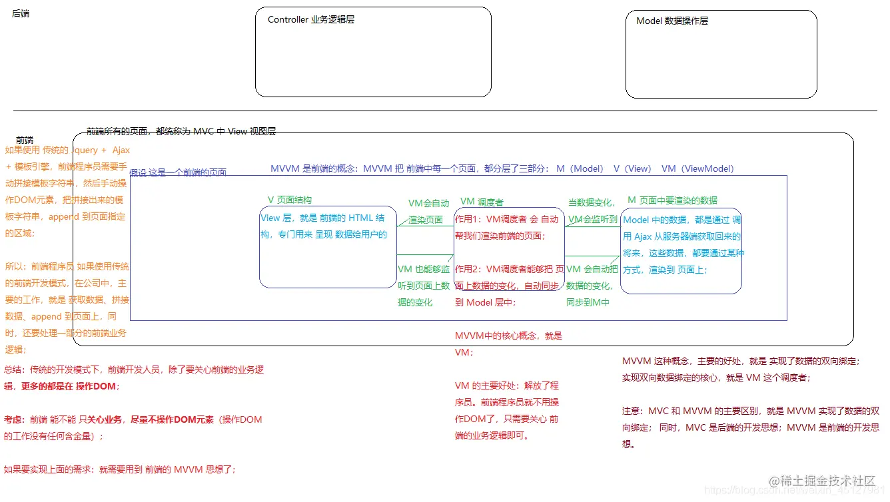
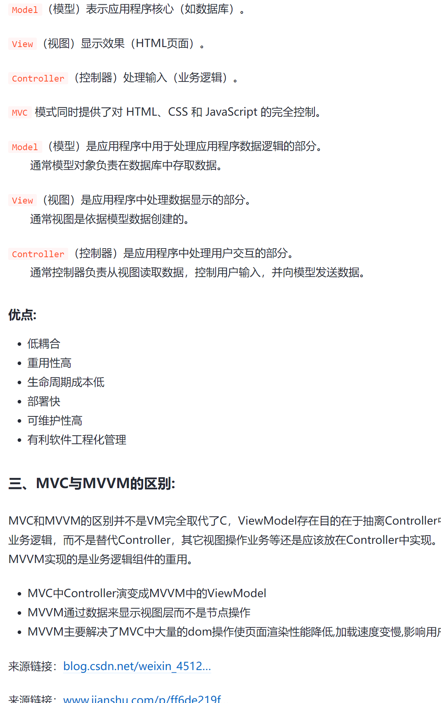

#  目录

<!-- [TOC] -->
- [目录](#目录)
- [Html部分](#html部分)
  - [H5新特性](#h5新特性)
  - [行块标签](#行块标签)
  - [cookies，sessionStorage 和 localStorage 的区别？](#cookiessessionstorage-和-localstorage-的区别)
  - [DOCTYPE 的作用是什么](#doctype-的作用是什么)
  - [标准模式与兼容模式各有什么区别？](#标准模式与兼容模式各有什么区别)
  - [页面导入样式时，使用 link 和 @import 有什么区别？](#页面导入样式时使用-link-和-import-有什么区别)
  - [对浏览器的理解](#对浏览器的理解)
  - [浏览器的渲染原理](#浏览器的渲染原理)
  - [渲染过程中遇到 JS 文件怎么处理？](#渲染过程中遇到-js-文件怎么处理)
  - [async 和 defer 的作用是什么？有什么区别？（浏览器解析过程）](#async-和-defer-的作用是什么有什么区别浏览器解析过程)
  - [什么是文档的预解析？](#什么是文档的预解析)
  - [渲染页面时常见哪些不良现象？](#渲染页面时常见哪些不良现象)
  - [如何优化关键渲染路径？](#如何优化关键渲染路径)
  - [DOMContentLoaded 事件和 Load 事件的区别](#domcontentloaded-事件和-load-事件的区别)
  - [如何处理 HTML5 新标签的浏览器兼容问题](#如何处理-html5-新标签的浏览器兼容问题)
  - [简述一下你对 HTML 语义化的理解](#简述一下你对-html-语义化的理解)
  - [b 与 strong 的区别和 i 与 em 的区别](#b-与-strong-的区别和-i-与-em-的区别)
  - [前端需要注意哪些 SEO](#前端需要注意哪些-seo)
  - [iframe 有那些缺点？](#iframe-有那些缺点)
  - [HTML5 的 form 的自动完成功能是什么](#html5-的-form-的自动完成功能是什么)
  - [如何实现浏览器内多个标签页之间的通信](#如何实现浏览器内多个标签页之间的通信)
  - [webSocket 如何兼容低版本浏览器](#websocket-如何兼容低版本浏览器)
  - [页面可见性（Page Visibility API） 可以有哪些用途](#页面可见性page-visibility-api-可以有哪些用途)
  - [如何在页面上实现一个圆形的可点击区域](#如何在页面上实现一个圆形的可点击区域)
  - [Canvas 和 SVG 有什么区别](#canvas-和-svg-有什么区别)
  - [渐进增强和优雅降级的定义](#渐进增强和优雅降级的定义)
  - [attribute 和 property 的区别是什么？](#attribute-和-property-的区别是什么)
  - [对 web 标准、可用性、可访问性的理解](#对-web-标准可用性可访问性的理解)
  - [IE 各版本和 Chrome 可以并行下载多少个资源](#ie-各版本和-chrome-可以并行下载多少个资源)
  - [Flash、Ajax 各自的优缺点，在使用中如何取舍](#flashajax-各自的优缺点在使用中如何取舍)
  - [怎么重构页面](#怎么重构页面)
  - [浏览器架构](#浏览器架构)
  - [常用的 meta 标签](#常用的-meta-标签)
  - [css reset 和 normalize.css 有什么区别](#css-reset-和-normalizecss-有什么区别)
  - [用于预格式化文本的标签](#用于预格式化文本的标签)
  - [DHTML 是什么](#dhtml-是什么)
  - [head 标签中必不少的是](#head-标签中必不少的是)
  - [disabled 和 readonly 的区别](#disabled-和-readonly-的区别)
  - [前端性能优化](#前端性能优化)
  - [Html 规范中为什么要求引用资源不加协议头http或者https](#html-规范中为什么要求引用资源不加协议头http或者https)
- [CSS部分](#css部分)
  - [CSS选择器](#css选择器)
  - [CSS权重的计算](#css权重的计算)
  - [CSS定位](#css定位)
  - [绘制三角形](#绘制三角形)
  - [CSS隐藏元素](#css隐藏元素)
  - [清除浮动](#清除浮动)
  - [CSS 的定位属性和区别。](#css-的定位属性和区别)
  - [flex:值](#flex值)
  - [样式继承](#样式继承)
  - [水平垂直居中](#水平垂直居中)
  - [回流和重绘](#回流和重绘)
  - [如何减少回流](#如何减少回流)
  - [li 与 li 之间有看不见的空白间隔是什么原因引起的？有什么解决办法？](#li-与-li-之间有看不见的空白间隔是什么原因引起的有什么解决办法)
  - [CSS 里的 visibility 属性有个 collapse 属性值是干嘛用的？在不同浏览器下以后什么区别](#css-里的-visibility-属性有个-collapse-属性值是干嘛用的在不同浏览器下以后什么区别)
  - [简单介绍使用图片 base64 编码的优点和缺点](#简单介绍使用图片-base64-编码的优点和缺点)
  - [margin 重叠问题的理解](#margin-重叠问题的理解)
- [JS部分](#js部分)
  - [什么是变量提升和函数提升](#什么是变量提升和函数提升)
  - [var、let、const 的区别](#varletconst-的区别)
  - [JS 的数据类型有哪些？](#js-的数据类型有哪些)
  - [JS 的数据类型的转换方式](#js-的数据类型的转换方式)
  - [JS 中引用类型和基本类型的区别](#js-中引用类型和基本类型的区别)
  - [判断数组的方法](#判断数组的方法)
  - [判断数据类型](#判断数据类型)
  - [数组的 API 中哪些会改变原数组哪些不会](#数组的-api-中哪些会改变原数组哪些不会)
  - [箭头函数和普通函数的区别](#箭头函数和普通函数的区别)
  - [this 的指向有哪些？如何改变 this 指向以及区别](#this-的指向有哪些如何改变-this-指向以及区别)
  - [什么是原型和原型链](#什么是原型和原型链)
  - [new 关键字的工作步骤](#new-关键字的工作步骤)
  - [Promise 的三种状态](#promise-的三种状态)
  - [异步解决方案发展](#异步解决方案发展)
  - [事件循环](#事件循环)
  - [ES6 的新特性](#es6-的新特性)
  - [reduce应用](#reduce应用)
    - [数组扁平化](#数组扁平化)
    - [计数](#计数)
- [VUE部分](#vue部分)
  - [Vue2 的响应式原理](#vue2-的响应式原理)
  - [template 的编译过程。](#template-的编译过程)
  - [Vue 的响应式系统无法检测到数据的哪些变化？以及解决方案。](#vue-的响应式系统无法检测到数据的哪些变化以及解决方案)
  - [Vue 的常用指令有哪些？](#vue-的常用指令有哪些)
  - [keep-alive 的作用以及特点](#keep-alive-的作用以及特点)
  - [Vue 组件之间的通信方式有哪些？](#vue-组件之间的通信方式有哪些)
  - [父子组件之间生命周期函数的执行顺序](#父子组件之间生命周期函数的执行顺序)
  - [Vue 组件首次渲染会执行哪些生命周期函数？](#vue-组件首次渲染会执行哪些生命周期函数)
  - [Vue 组件的生命周期函数有哪些？](#vue-组件的生命周期函数有哪些)
  - [v-model 的语法糖是什么？](#v-model-的语法糖是什么)
  - [computed 和 watch 的区别](#computed-和-watch-的区别)
  - [computed 和 methods 的区别](#computed-和-methods-的区别)
  - [v-for 中 key 属性的作用是什么？](#v-for-中-key-属性的作用是什么)
  - [v-if 和 v-show 的区别。](#v-if-和-v-show-的区别)
  - [Vue 组件中渲染数据的方式有哪些？区别是什么？](#vue-组件中渲染数据的方式有哪些区别是什么)
  - [Vue 组件中的 data，为什么必须是函数](#vue-组件中的-data为什么必须是函数)
  - [MVVM 和 MVC 的区别](#mvvm-和-mvc-的区别)


# Html部分

## H5新特性

- 拖拽（Drap and drop)
- 自定义属性
- 音，视频标签：（video，audio）
- 语义化标签：（nav,header,foot,aside,article)

- Canvas
- Geolocation
- localStorage ,sessionStorage
- 表单控件：calendar , date , time , email , url , search , tel , file

## 行块标签

- 行内元素:
  - [b](https://developer.mozilla.org/zh-CN/docs/Web/HTML/Element/b), [big](https://developer.mozilla.org/zh-CN/docs/Web/HTML/Element/big), [i](https://developer.mozilla.org/zh-CN/docs/Web/HTML/Element/i), [small](https://developer.mozilla.org/zh-CN/docs/Web/HTML/Element/small), [tt](https://developer.mozilla.org/zh-CN/docs/Web/HTML/Element/tt)
  - [abbr](https://developer.mozilla.org/zh-CN/docs/Web/HTML/Element/abbr), [acronym](https://developer.mozilla.org/zh-CN/docs/Web/HTML/Element/acronym), [cite](https://developer.mozilla.org/zh-CN/docs/Web/HTML/Element/cite), [code](https://developer.mozilla.org/zh-CN/docs/Web/HTML/Element/code), [dfn](https://developer.mozilla.org/zh-CN/docs/Web/HTML/Element/dfn), [em](https://developer.mozilla.org/zh-CN/docs/Web/HTML/Element/em), [kbd](https://developer.mozilla.org/zh-CN/docs/Web/HTML/Element/kbd), [strong](https://developer.mozilla.org/zh-CN/docs/Web/HTML/Element/strong), [samp](https://developer.mozilla.org/zh-CN/docs/Web/HTML/Element/samp), [var](https://developer.mozilla.org/zh-CN/docs/Web/HTML/Element/var)
  - [a](https://developer.mozilla.org/zh-CN/docs/Web/HTML/Element/a), [bdo](https://developer.mozilla.org/zh-CN/docs/Web/HTML/Element/bdo), [br](https://developer.mozilla.org/zh-CN/docs/Web/HTML/Element/br), [img](https://developer.mozilla.org/zh-CN/docs/Web/HTML/Element/img), [map](https://developer.mozilla.org/zh-CN/docs/Web/HTML/Element/map), [object](https://developer.mozilla.org/zh-CN/docs/Web/HTML/Element/object), [q](https://developer.mozilla.org/zh-CN/docs/Web/HTML/Element/q), [script](https://developer.mozilla.org/zh-CN/docs/Web/HTML/Element/script), [span](https://developer.mozilla.org/zh-CN/docs/Web/HTML/Element/span), [sub](https://developer.mozilla.org/zh-CN/docs/Web/HTML/Element/sub), [sup](https://developer.mozilla.org/zh-CN/docs/Web/HTML/Element/sup)
  - [button](https://developer.mozilla.org/zh-CN/docs/Web/HTML/Element/button), [input](https://developer.mozilla.org/zh-CN/docs/Web/HTML/Element/Input), [label](https://developer.mozilla.org/zh-CN/docs/Web/HTML/Element/label), [select](https://developer.mozilla.org/zh-CN/docs/Web/HTML/Element/select), [textarea](https://developer.mozilla.org/zh-CN/docs/Web/HTML/Element/textarea)
- 块级元素:
  - p,div,ul,li,
  - hr,h1~h6
  - table
  - form
- 区别:
  - 行内元素不支持尺寸,块级元素支持
  - 行内元素不支持垂直方向的margin,块级元素支持
  - 行内元素同行显示,块级独占一行

## cookies，sessionStorage 和 localStorage 的区别？

- 存储大小：
  - cookie 数据大小不能超过4 k 。
  - sessionStorage 和 localStorage 虽然也有存储大小的限制，但比 cookie 大得多，可以达到 5M 或更大。

- 有期时间:
  - localStorage:存储持久数据，浏览器关闭后数据不丢失除非主动删除数据。
  - sessionStorage:数据在页面会话结束时会被清除。页面会话在浏览器打开期间一直保持，并且重新加载或恢复页面仍会保持原来的页面会话。在新标签或窗口打开一个页面时会在顶级浏览上下文中初始化一个新的会话。
  - cookie:设置的 cookie 过期时间之前一直有效，即使窗口或浏览器关闭。

- 作用域：
  - sessionStorage :只在同源的同窗口（或标签页）中共享数据，也就是只在当前会话中共享
  -  localStorage : 在所有同源窗口中都是共享的。
  - cookie:在所有同源窗口中都是共享的。

## DOCTYPE 的作用是什么

<!DOCTYPE>声明位于 HTML 文档中的第一行，处于 <html> 标签之前。告知浏览器的解析器用什么文档标准解析这个文档。

DOCTYPE 不存在或格式不正确会导致文档以兼容模式呈现。

## 标准模式与兼容模式各有什么区别？

标准模式的渲染方式和 JS 引擎的解析方式都是以该浏览器支持的最高标准运行。在兼容模式中，页面以宽松的向后兼容的方式显示，模拟老式浏览器的行为以防止站点无法工作。

##  页面导入样式时，使用 link 和 @import 有什么区别？

- 从属关系区别。 @import 是 CSS 提供的语法规则，只有导入样式表的作用；link 是 HTML 提供的标签，不仅可以加载 CSS 文件，还可以定义 RSS、rel 连接属性、引入网站图标等。
- 加载顺序区别。加载页面时，link 标签引入的 CSS 被同时加载；@import 引入的 CSS 将在页面加载完毕后被加载。
- 兼容性区别。@import 是 CSS2.1 才有的语法，故只可在 IE5+ 才能识别；link 标签作为 HTML 元素，不存在兼容性问题。
- DOM 可控性区别。可以通过 JS 操作 DOM ，插入 link 标签来改变样式；由于 DOM 方法是基于文档的，无法使用 @import 的方式插入样式。

## 对浏览器的理解

- 浏览器的主要功能是将用户选择的 web 资源呈现出来，它需要从服务器请求资源，并将其显示在浏览器窗口中，资源的格式通常是 HTML，也包括 PDF、image 及其他格式。用户用 URI（Uniform Resource Identifier 统一资源标识符）来指定所请求资源的位置。

- 简单来说浏览器可以分为两部分，`shell `和 `内核`。

  - 其中 shell 的种类相对比较多，内核则比较少。shell 是指浏览器的外壳：例如菜单，工具栏等。主要是提供给用户界面操作，

  - 内核主要分成两部分：`渲染引擎`和 `JS 引擎`。

    - 渲染引擎的职责就是渲染，即在浏览器窗口中显示所请求的内容。默认情况下，渲染引擎可以显示 html、xml 文档及图片，它也可以借助插件（一种浏览器扩展）显示其他类型数据，例如使用 PDF 阅读器插件，可以显示 PDF 格式。

    - JS 引擎：`解析和执行 javascript 来实现网页的动态效果`。最开始渲染引擎和 JS 引擎并没有区分的很明确，后来 JS 引擎越来越独立，内核就倾向于只指渲染引擎。

  -  浏览器并不区分外壳和内核。从 Mozilla 将 Gecko 独立出来后，才有了外壳和内核的明确划

##  浏览器的渲染原理

- 首先解析收到的文档，根据文档定义构建一棵 DOM 树，DOM 树是由 DOM 元素及属性节点组成的。
- 然后对 CSS 进行解析，生成 CSSOM 规则树。
- 根据 DOM 树和 CSSOM 规则树构建渲染树。渲染树的节点被称为渲染对象，渲染对象是一个包含有颜色和大小等属性的矩形，渲染对象和 DOM 元素相对应，但这种对应关系不是一对一的，不可见的 DOM 元素不会被插入渲染树。还有一些 DOM 元素对应几个可见对象，它们一般是一些具有复杂结构的元素，无法用一个矩形来描述。
- 当渲染对象被创建并添加到树中，它们并没有位置和大小，所以当浏览器生成渲染树以后，就会根据渲染树来进行布局（也可以叫做回流）。这一阶段浏览器要做的事情是要弄清楚各个节点在页面中的确切位置和大小。通常这一行为也被称为“自动 重排”。
- 布局阶段结束后是绘制阶段，遍历渲染树并调用渲染对象的 paint 方法将它们的内容显示在屏幕上，绘制使用 UI 基础组件。

- 值得注意的是，这个过程是逐步完成的，为了更好的用户体验，渲染引擎将会尽可能早的将内容呈现到屏幕上，并不会等到所有的html 都解析完成之后再去构建和布局 render 树。它是解析完一部分内容就显示一部分内容，同时，可能还在通过网络下载其余内容。

##  渲染过程中遇到 JS 文件怎么处理？

-  JavaScript 的加载、解析与执行会阻塞文档的解析，也就是说，在构建 DOM 时，HTML 解析器若遇到了 JavaScript，那么它会暂停文档的解析，将控制权移交给 JavaScript 引擎，等 JavaScript 引擎运行完毕，浏览器再从中断的地方恢复继续解析文档。
- 也就是说，如果你想首屏渲染的越快，就越不应该在首屏就加载 JS 文件，这也是都建议将 script 标签放在 body 标签底部的原因。当然在当下，并不是说 script 标签必须放在底部，因为你可以给 script 标签添加 defer 或者 async 属性。

##  async 和 defer 的作用是什么？有什么区别？（浏览器解析过程）

- 脚本没有 defer 或 async，浏览器会立即加载并执行指定的脚本，也就是说不等待后续载入的文档元素，读到就加载并执行。

- defer 属性表示延迟执行引入的 JavaScript，即这段 JavaScript 加载时 HTML 并未停止解析，这两个过程是并行的。当整个 document 解析完毕后再执行脚本文件，在 DOMContentLoaded 事件触发之前完成。多个脚本按顺序执行。

- async 属性表示异步执行引入的 JavaScript，与 defer 的区别在于，如果已经加载好，就会开始执行，也就是说它的执行仍然会阻塞文档的解析，只是它的加载过程不会阻塞。多个脚本的执行顺序无法保证。

##  什么是文档的预解析？

- Webkit 和 Firefox 都做了这个优化，当执行 JavaScript 脚本时，另一个线程解析剩下的文档，并加载后面需要通过网络加载的资源。
- 这种方式可以使资源并行加载从而使整体速度更快。需要注意的是，预解析并不改变 DOM 树，它将这个工作留给主解析过程，自己只解析外部资源的引用，比如外部脚本、样式表及图片。

##  渲染页面时常见哪些不良现象？

- FOUC：主要指的是样式闪烁的问题，由于浏览器渲染机制（比如firefox），在 CSS 加载之前，先呈现了HTML，就会导致展示出无样式内容，然后样式突然呈现的现象。会出现这个问题的原因主要是 CSS 加载时间过长，或者 CSS 被放在了文档底部。

- 白屏：有些浏览器渲染机制（比如chrome）要先构建 DOM 树和 CSSOM 树，构建完成后再进行渲染，如果 CSS 部分放在 HTML 尾部，由于 CSS 未加载完成，浏览器迟迟未渲染，从而导致白屏；也可能是把 JS 文件放在头部，脚本的加载会阻塞后面文档内容的解析，从而页面迟迟未渲染出来，出现白屏问题。

## 如何优化关键渲染路径？

- **关键渲染路径**是浏览器将 HTML，CSS 和 JavaScript 转换为屏幕上的像素所经历的步骤序列

- 对关键路径进行分析和特性描述：资源数、字节数、长度。
- 最大限度减少关键资源的数量：删除它们，延迟它们的下载，将它们标记为异步等。
- 优化关键字节数以缩短下载时间（往返次数）。
- 优化其余关键资源的加载顺序：您需要尽早下载所有关键资产，以缩短关键路径长度。

## DOMContentLoaded 事件和 Load 事件的区别

- 当初始的 HTML 文档被完全加载和解析完成之后，DOMContentLoaded 事件被触发，而无需等待样式表、图像和子框架的加载完成。

- Load 事件是当所有资源加载完成后触发的。

## 如何处理 HTML5 新标签的浏览器兼容问题

-  IE8/IE7/IE6 支持通过 document.createElement 方法产生的标签，可以利用这一特性让这些浏览器支持 HTML5 新标签，浏览器支持新标签后，还需要添加标签默认的样式。
- 当然也可以直接使用成熟的框架，比如 html5shiv ;

##  简述一下你对 HTML 语义化的理解

- html 语义化让页面的内容结构化，结构更清晰，便于对浏览器、搜索引擎解析;
- 即使在没有样式 CSS 情况下也以一种文档格式显示，并且是容易阅读的;
-  搜索引擎的爬虫也依赖于 HTML 标记来确定上下文和各个关键字的权重，利于 SEO ;
- 使阅读源代码的人对网站更容易将网站分块，便于阅读维护理解。

##  b 与 strong 的区别和 i 与 em 的区别

- <b> <i> 是自然样式标签，分别表示无意义的加粗，无意义的斜体，表现样式为 { font-weight: bolder}，仅仅表示「`这里应该用粗体显示`」或者「这里应该用斜体显示」，此两个标签在` HTML4.01 中并不被推荐使用`。
-  <em> 和 <strong> 是语义样式标签。 <em> 表示一般的强调文本，而 <strong> 表示比 <em> 语义更强的强调文本
-  使用阅读设备阅读网页时：<strong> 会重读，而 <b> 是展示强调内容。

## 前端需要注意哪些 SEO

- 合理的 title、description、keywords：搜索对着三项的权重逐个减小，title 值强调重点即可，重要关键词出现不要超过2次，而且要靠前，不同页面 title 要有所不同；description 把页面内容高度概括，长度合适，不可过分堆砌关键词，不同页面 description 有所不同；keywords 列举出重要关键词即可。

- 语义化的 HTML 代码，符合 W3C 规范：语义化代码让搜索引擎容易理解网页。

- 重要内容 HTML 代码放在最前：搜索引擎抓取 HTML 顺序是从上到下，有的搜索引擎对抓取长度有限制，保证重要内容肯定被
       抓取。

- 重要内容不要用 js 输出：爬虫不会执行 js 获取内容

- 少用 iframe：搜索引擎不会抓取 iframe 中的内容

- 非装饰性图片必须加 alt

- 提高网站速度：网站速度是搜索引擎排序的一个重要指标

##  iframe 有那些缺点？

- iframe 会阻塞主页面的 onload 事件。window 的 onload 事件需要在所有 iframe 加载完毕后（包含里面的元素）才 会触发。在 Safari 和 Chrome 里，通过 JavaScript 动态设置 iframe 的 src 可以避免这种阻塞情况
-  搜索引擎的检索程序无法解读这种页面，不利于网页的 SEO 。
-  iframe 和主页面共享连接池，而浏览器对相同域的连接有限制，所以会影响页面的并行加载。
-  浏览器的后退按钮失效。
- 小型的移动设备无法完全显示框架。

## HTML5 的 form 的自动完成功能是什么

## 如何实现浏览器内多个标签页之间的通信

- 使用 WebSocket，通信的标签页连接同一个服务器，发送消息到服务器后，服务器推送消息给所有连接的客户端。

- 使用 SharedWorker （只在 chrome 浏览器实现了），两个页面共享同一个线程，通过向线程发送数据和接收数据来实现标签页之间的双向通行。

- 可以调用 localStorage、cookies 等本地存储方式，localStorge 另一个浏览上下文里被添加、修改或删除时，它都会触发一个 storage 事件，我们通过监听 storage 事件，控制它的值来进行页面信息通信；

- 如果我们能够获得对应标签页的引用，通过 postMessage 方法也是可以实现多个标签页通信的。

## webSocket 如何兼容低版本浏览器

- Adobe Flash Socket 、
-  ActiveX HTMLFile (IE) 、
- 基于 multipart 编码发送 XHR 、
-  基于长轮询的 XHR

##  页面可见性（Page Visibility API） 可以有哪些用途

- 这个新的 API 的意义在于，通过监听网页的可见性，可以预判网页的卸载，还可以用来节省资源，减缓电能的消耗。比如，一旦用户不看网页，下面这些网页行为都是可以暂停的。

  - 对服务器的轮询
  - 网页动画
  - 正在播放的音频或视频


## 如何在页面上实现一个圆形的可点击区域

（1）纯 html 实现，使用 <area> 来给  图像标记热点区域的方式，<map> 标签用来定义一个客户端图像映射，<area> 标签用来定义图像映射中的区域，area 元素永远嵌套在 map 元素内部，我们可以将 area 区域设置为圆形，从而实现可点击的圆形区域。

 （2）纯 css 实现，使用 border-radius ，当 border-radius 的长度等于宽高相等的元素值的一半时，即可实现一个圆形的
     点击区域。

 （3）纯 js 实现，判断一个点在不在圆上的简单算法，通过监听文档的点击事件，获取每次点击时鼠标的位置，判断该位置是否在我们规定的圆形区域内。

## Canvas 和 SVG 有什么区别

-  Canvas 是一种通过 JavaScript 来绘制 2D 图形的方法。Canvas 是逐像素来进行渲染的，因此当我们对 Canvas 进行缩放时，会出现锯齿或者失真的情况。
-  SVG 是一种使用 XML 描述 2D 图形的语言。SVG 基于 XML，这意味着 SVG DOM 中的每个元素都是可用的。我们可以为某个元素附加 JavaScript 事件监听函数。并且 SVG 保存的是图形的绘制方法，因此当 SVG 图形缩放时并不会失真。

## 渐进增强和优雅降级的定义

- 渐进增强：针对低版本浏览器进行构建页面，保证最基本的功能，然后再针对高级浏览器进行效果、交互等改进和追加功能达到更好的用户体验。

- 优雅降级：一开始就根据高版本浏览器构建完整的功能，然后再针对低版本浏览器进行兼容。

##  attribute 和 property 的区别是什么？

-  HTML属性 (attribute)和 DOM属性(property)，是相互关联的。多数情况attribute值仅用作初始DOM节点对象使用，而property更多用于页面交互，很多框架都是在与元素和指令的 property和事件打交道。
- 对于 html 的标准属性来说，attribute 和 property 是同步的，是会自动更新的， 但是对于自定义的属性来说，他们是不同步的。

## 对 web 标准、可用性、可访问性的理解

- 可用性（Usability）：产品是否容易上手，用户能否完成任务，效率如何，以及这过程中用户的主观感受可好，是从用户的角度来看产品的质量。可用性好意味着产品质量高，是企业的核心竞争力

- 可访问性（Accessibility）：Web 内容对于残障用户的可阅读和可理解性

- 可维护性（Maintainability）：一般包含两个层次，一是当系统出现问题时，快速定位并解决问题的成本，成本低则可维护性好。二是代码是否容易被人理解，是否容易修改和增强功能。

##  IE 各版本和 Chrome 可以并行下载多少个资源

- IE6 2 个并发
-  iE7 升级之后的 6 个并发，之后版本也是 6 个
-   Firefox，chrome 也是6个

## Flash、Ajax 各自的优缺点，在使用中如何取舍

- Flash：
  - Flash 适合处理多媒体 、矢量图形、访问机器
  - 对 CSS、处理文本上不足，不容易被搜索
- Ajax :
  - 与服务器的无刷新传递消息
  - 可以检测用户离线和在线状态
  - 操作 DOM

## 怎么重构页面

- 编写 CSS
-  让页面结构更合理化，提升用户体验
-  实现良好的页面效果和提升性能

##  浏览器架构

```javascript
 * 用户界面
   * 主进程
   * 内核
       * 渲染引擎
       * JS 引擎
           * 执行栈
       * 事件触发线程
           * 消息队列
               * 微任务
               * 宏任务
       * 网络异步线程
       * 定时器线程
```

## 常用的 meta 标签

```javascript
 <meta> 元素可提供有关页面的元信息（meta-information），比如针对搜索引擎和更新频度的描述和关键词。
 <meta> 标签位于文档的头部，不包含任何内容。<meta> 标签的属性定义了与文档相关联的名称/值对。
```


## css reset 和 normalize.css 有什么区别

## 用于预格式化文本的标签

- 预格式化就是保留文字在源码中的格式 最后显示出来样式与源码中的样式一致 所见即所得。

- /<pre> 定义预格式文本，保持文本原有的格式


## DHTML 是什么

- DHTML 将 HTML、JavaScript、DOM 以及 CSS 组合在一起，用于创造动态性更强的网页。通过 JavaScript 和 HTML DOM，能够动态地改变 HTML 元素的样式
- DHTML 实现了网页从 Web 服务器下载后无需再经过服务的处理，而在浏览器中直接动态地更新网页的内容、排版样式和动画的功能。例如，当鼠标指针移到文章段落中时，段落能够变成蓝色，或者当鼠标指针移到一个超级链接上时，会自动生成一个下拉式子链接目录等。

## head 标签中必不少的是

- //<head> 标签用于定义文档的头部，它是所有头部元素的容器。<head> 中的元素可以引用脚本、指示浏览器在哪里找到样式表、提供元信息等等

- 文档的头部描述了文档的各种属性和信息，包括文档的标题、在 Web 中的位置以及和其他文档的关系等。绝大多数文档头部包含的数据都不会真正作为内容显示给读者。

- 下面这些标签可用在 head 部分：<base>, <link>, <meta>, <script>, <style>, 以及 <title>。
- // <title>是必不可少的

## disabled 和 readonly 的区别

- disabled 指当 input 元素加载时禁用此元素。input 内容不会随着表单提交。
- readonly 规定输入字段为只读。input 内容会随着表单提交。

-  无论设置 readonly 还是 disabled，通过 js 脚本都能更改input 的 value

## 前端性能优化

- 页面的内容方面
  - 图片Bsse64格式，CSS雪碧图，减少 HTTP 请求数，避免过多的请求造成等待的情况
  - 通过 DNS 缓存等机制来减少 DNS 的查询次数
  - 通过设置缓存策略，对常用不变的资源进行缓存
  - 使用延迟加载的方式，来减少页面首屏加载时需要请求的资源，延迟加载的资源当用户需要访问时，再去请求加载
  - 通过用户行为，对某些资源使用预加载的方式，来提高用户需要访问资源时的响应速度
- 服务器方面
  - 使用 CDN 服务，来提高用户对于资源请求时的响应速度
  - 服务器端启用 Gzip、Deflate 等方式对于传输的资源进行压缩，减小文件的体积。
  - 尽可能减小 cookie 的大小，并且通过将静态资源分配到其他域名下，来避免对静态资源请求时携带不必要的 cookie
- CSS 和 JavaScript 方面
  - 把样式表放在页面的 head 标签中，减少页面的首次渲染的时间。
  - 避免使用 @import 标签。
  - 尽量把 js 脚本放在页面底部或者使用 defer 或 async 属性，避免脚本的加载和执行阻塞页面的渲染。
  - 通过对 JavaScript 和 CSS 的文件进行压缩，来减小文件的体积。

## Html 规范中为什么要求引用资源不加协议头http或者https

-  如果用户当前访问的页面是通过 HTTPS 协议来浏览的，那么网页中的资源也只能通过 HTTPS 协议来引用，否则浏览器会出现
   警告信息，不同浏览器警告信息展现形式不同。
- 为了解决这个问题，我们可以省略 URL 的协议声明，省略后浏览器照样可以正常引用相应的资源，这项解决方案称为protocol-relative URL，暂且可译作协议相对 URL。
- 如果使用协议相对 URL，无论是使用 HTTPS，还是 HTTP 访问页面，浏览器都会以相同的协议请求页面中的资源，避免弹出类似
   的警告信息，同时还可以节省5字节的数据量。


# CSS部分

## CSS选择器

- id选择器:#foot
- 类选择器:.foot
- 标签选择器:div
- 后代选择器:div span
- 子选择器:div>span
- 相邻兄弟选择器:div+span
- 后续兄弟选择器:div~span
- 属性选择器:[属性名]
  - 精确匹配:[属性名=属性值]
  - 模糊匹配:[属性名*=属性值]
- 伪类选择器
  - :link
  - :hover
  - :active
  - :nth-child()
  - :first-child()
- 伪元素选择器
  - ::after
  - ::before
  - ::first-letter
  - ::first-line

## CSS权重的计算

- !important权重最高

- 相同的选择器时，内联权重最高，内部和外部采用就近原则，离标签近的优先作用

- 不同的选择器时，基础选择器优先级（权重大小）：

  id选择器 > 类选择器(属性选择器) > 标签选择器 > 通配符选择器 > 继承的样式

- 组合选择器是由多种基础选择器构成，需要将多种基础选择器权重叠加计算出来得出最终的权重的大小

- 权重计算:

  - 将所有的基础选择器的权重相加，对比权重值，值大的权重越大

    - 内联样式的权重值为1000

    - id选择器的权重值为100

    - 类（属性）选择器的权重为10

    - 标签选择器的权重值为1

    - 继承的样式权重为0

      注意：不满足满10进1的规则，十几个标签选择器都没有一个类选择器大

  - 4个0

    - 第一个0：代表有无内联样式，有则为1，没有则为0

    - 第二个0：代表id选择器的个数

    - 第三个0：代表类（属性）选择器的个数

    - 第四个0：代表标签选择器的个数

    - 从第一个0开始对比，值大的权重更大，如果相同，对比第二个0，以此类推，如果最后一个0 的位置也相同，权重大小是一样，后面的样式会盖住前面的样式
## CSS定位

- absolute
- relative
- fixed
- sticky

## 绘制三角形

- 任意两边的边框透明,设置为三角形侧边,其他任意一个方向的边框设置的三角形的底边,并设置颜色,宽高调0

## CSS隐藏元素

- display:none 不占用空间,会回流操作 性能开销较大，

- visibility:hidden 占用空间,是重绘操作 比回流操作性能高一些，（回流会计算相邻元素甚至组先级元素的位置，属性等）
- overflow: hidden 溢出隐藏
- html标签上的hidden属性
- opacity:0 透明 重建图层，性能较高
- clip-path: circle(0); 创建一个裁剪区域

## 清除浮动

- clear:both
- overfllow:hidden
- 全部浮动
- 设置高度
- 伪元素

## CSS 的定位属性和区别。

**static**：  默认值，元素没有开启定位
**relative**：  开启元素的相对定位
1.当开启了元素的相对定位以后，而不设置偏移量时，元素不会发生任何变化
2.相对定位是相对于元素在文档流中原来的位置进行定位
3.相对定位的元素不会脱离文档流
4.相对定位会使元素提升一个层级
5.相对定位不会改变元素的性质，块还是块，内联还是内联
**absolute**：  开启元素的绝对定位
1.绝对定位的元素会脱离文档流，在标准文档流之上
2.只设置绝对定位的元素是在当前位置脱离文档流，一旦设置了偏移量，绝对定位的元素默认是参考整个文档进行移动或参考最近的定位父级进行移动
3.原来的空间不再占用
4.绝对定位会改变元素的性质，开启BFC属性，内联元素可设宽高，块元素的宽度和高度默认都被内容撑开

**fixed**：开启元素的固定定位（也是绝对定位的一种）
1.用于固定在浏览器页面上，不随浏览器的滚动而改变位置；
2.以浏览器为参照物，和父元素没有任何关系；
3.固定定位不占有原来的位置，即脱离标准流 ,一旦脱离文档流，就会改变元素的性质，就不再区分块元素、行内元素、行内块元素

**sticky**：  开启元素的粘滞定位
1.以浏览器为参照物，粘滞定位可以在元素到达某个位置时，将其固定 （体现固定定位特点）；
2.元素不会脱离文档流，其性质也不会发生变化,占有原来位置（体现相对定位特点）；
3.没有达到top值之前正常显示，达到top值之后类似于固定定位，不会跟随滚动条滚动而滚动

## flex:值

- flex-group:默认值1,当书写flex:值时,被修改成flex属性的值
- flex-shrink:1
- flex-basis当书写flex:值时,如果flex的是数字,flex-basis被修改成0%发,flex的不是数字,flex-basis被修改成auto;

## 样式继承

- 字体系列属性
  - font、font-family、font-weight、font-size、font-style、font-variant、font-stretch、font-size-adjust

- 文本系列属性
  - text-indent、text-align、text-shadow、line-height、word-spacing、letter-spacing、text-transform、direction、color

- 表格布局属性
  - caption-side border-collapse empty-cells

- 列表属性
  - list-style-type、list-style-image、list-style-position、list-style

- 光标属性
  - cursor

- 元素可见性
  - visibility

- 还有一些不常用的；speak，page，设置嵌套引用的引号类型quotes等属性

## 水平垂直居中

- 水平垂直居中一

```javascript
/*确定容器的宽高宽500高300的层设置层的外边距div{*/
position: absolute;/*绝对定位*/
width: 500px;
height: 300px;
top: 50%;
left: 50%;
margin: -150px 0 0 -250px;/*外边距为自身宽高的一半*/
background-color: pink;/*方便看效果*/
}
```

- 水平垂直居中二

```javascript
/*未知容器的宽高，利用`transform`属性*/
div {
  position: absolute; /*相对定位或绝对定位均可*/
  width: 500px;
  height: 300px;
  top: 50%;
  left: 50%;
  transform: translate(-50%, -50%);
  background-color: pink; /*方便看效果*/
}
```

- 水平垂直居中三

```javascript
/*利用flex布局实际使用时应考虑兼容性*/
.container {
  display: flex;
  align-items: center; /*垂直居中*/
  justify-content: center; /*水平居中*/
}
.containerdiv {
  width: 100px;
  height: 100px;
  background-color: pink; /*方便看效果*/
}
```

- 水平垂直居中四

```javascript
/*利用text-align:center和vertical-align:middle属性*/
.container {
  position: fixed;
  top: 0;
  right: 0;
  bottom: 0;
  left: 0;
  background: rgba(0, 0, 0, 0.5);
  text-align: center;
  font-size: 0;
  white-space: nowrap;
  overflow: auto;
}

.container::after {
  content: '';
  display: inline-block;
  height: 100%;
  vertical-align: middle;
}

.box {
  display: inline-block;
  width: 500px;
  height: 400px;
  background-color: pink;
  white-space: normal;
  vertical-align: middle;
}
```

## 回流和重绘

- 重绘: 当渲染树中的一些元素需要更新属性，而这些属性只是影响元素的外观、风格，而不会影响布局的操作，比如 background-color，我们将这样的操作称为重绘。

- 回流：当渲染树中的一部分（或全部）因为元素的规模尺寸、布局、隐藏等改变而需要重新构建的操作，会影响到布局的操作，这样的操作我们称为回流。

- 常见引起回流属性和方法：
  - 任何会改变元素几何信息（元素的位置和尺寸大小）的操作，都会触发回流。
  - 添加或者删除可见的 DOM 元素；
  -  元素尺寸改变——边距、填充、边框、宽度和高度
  - 内容变化，比如用户在 input 框中输入文字
  - 浏览器窗口尺寸改变——resize事件发生时
  - 计算 offsetWidth 和 offsetHeight 属性
  - 设置 style 属性的值
  - 当你修改网页的默认字体时。

- 回流必定会发生重绘，重绘不一定会引发回流。回流所需的成本比重绘高的多，改变父节点里的子节点很可能会导致父节点的一系列回流。

## 如何减少回流

- 使用 transform 替代 top

- 不要把节点的属性值放在一个循环里当成循环里的变量

- 不要使用 table 布局，可能很小的一个小改动会造成整个 table 的重新布局

- 把 DOM 离线后修改。如：使用 documentFragment 对象在内存里操作 DOM

- 不要一条一条地修改 DOM 的样式。与其这样，还不如预先定义好 css 的 class，然后修改 DOM 的 className。

## li 与 li 之间有看不见的空白间隔是什么原因引起的？有什么解决办法？

- 原因：<li>换行后产生换行字符，它变成一个空格，占用了一个字符的宽度。

- 解决办法：
  - flow:left
  - 将所有<li>写在同一行。不足：代码不美观。
  - 将<ul>内的字符尺寸直接设为0，即font-size:0。不足：<ul>中的其他字符尺寸也被设为0，需要额外重新设定其他字符尺寸，且在Safari浏览器依然会出现空白间隔。
  - 消除<ul>的字符间隔letter-spacing:-8px，不足：这也设置了<li>内的字符间隔，因此需要将<li>内的字符间隔设为默认letter-spacing:normal。

## CSS 里的 visibility 属性有个 collapse 属性值是干嘛用的？在不同浏览器下以后什么区别

- 对于一般的元素，它的表现跟visibility：hidden;是一样的。元素是不可见的，但此时仍占用页面空间。

- 但例外的是，如果这个元素是table相关的元素，例如table行，table group，table列，table column group，它的表现却跟display:none一样，也就是说，它们占用的空间也会释放。

## 简单介绍使用图片 base64 编码的优点和缺点

- 使用base64的优点是：

  - 减少一个图片的HTTP请求

- 使用base64的缺点是：

  - 根据base64的编码原理，编码后的大小会比原文件大小大1/3，如果把大图片编码到html/css中，不仅会造成文件体积的增加，影响文件的加载速度，还会增加浏览器对html或css文件解析渲染的时间。

  - 使用base64无法直接缓存，要缓存只能缓存包含base64的文件，比如HTML或者CSS，这相比域直接缓存图片的效果要差很多。

  - 兼容性的问题，ie8以前的浏览器不支持。

## margin 重叠问题的理解


# JS部分


## 什么是变量提升和函数提升

- 变量提升的表现是，无论我们在函数中何处位置声明的变量，好像都被提升到了函数的首部，我们可以在变量声明前访问到而不会报错。

- 造成变量声明提升的本质原因是 js 引擎在代码执行前有一个解析的过程，创建了执行上下文，初始化了一些代码执行时需要用到的对象。当我们访问一个变量时，我们会到当前执行上下文中的作用域链中去查找，而作用域链的首端指向的是当前执行上下文的变量对象，这个变量对象是执行上下文的一个属性，它包含了函数的形参、所有的函数和变量声明，这个对象的是在代码解析的时候创建的。这就是会出现变量声明提升的根本原因。
- 函数提升，在预解析时将函数提升到作用域最顶端声明并定义

## var、let、const 的区别

- const使用必须要赋值，var,let 不需要
- const,let不可以重复声明，var可以
- let和const有块级作用域
- const,let有tdz,没有声明提升，var有

## JS 的数据类型有哪些？

- 基本数据类型
  - 数字 number
  - 字符串 string
  - 布尔值 boolean
  - 空 null
  - 未定义 undefined
  - 唯一值 Symbol
  - 无穷大 BigInt
- 引用数据类型
  - 对象 object

## JS 的数据类型的转换方式

- 转成数字

  - Number()

  - parseInt()

  - parseFloat()

- 转成字符串

  - String()

  - toString()

- 转成布尔值

  - Boolean()

    - 转换规则（除了6个以外，其他都是 true）

      - 0

      - “”

      - undefined

      - null

      - NaN

      - false


## JS 中引用类型和基本类型的区别

- 基本类型

  - 数据保存在栈内存中

- 引用类型

  - 数据保存在堆内存中

  - 数据的引用地址保存在栈内存中

## 判断数组的方法

- isArray
- instanceof
- contructor
- Object.prototype.toString.call()

## 判断数据类型

- typeof

- instanceof

- contructor

- Object.prototype.toString.call()

## 数组的 API 中哪些会改变原数组哪些不会

- 会改变

  - push()
  -  pop()
  - shift()
  - unshift()
  - splice()
  -  sort()
  -  reverse()

- 会改变

  - concat()

  - join()

  - slice()

  - indexOf()

  - includes()

  - find()

  - forEach()

  - map()

  - filter()

  - some()

  - every()

  - reduce()

## 箭头函数和普通函数的区别

- 不会创建的自己的this
- 继承来的this指向永远不会改变
- call，bind,apply不会改变this的指向
- 不能做构造函数
- 没有arguments
- 没有prototype
- 不能做Generator函数

## this 的指向有哪些？如何改变 this 指向以及区别

- 在对象函数里指调用函数的对象
- 在构造函数里指创造出来的对象
- 在类函数里指该类
- 在监听器里指绑定事件的元素
- 在箭头函数里指向外部的this的环境
- 兼容模式内部指widow,严格模式指undefind

## 什么是原型和原型链

- 原型

  - 每一个函数都有一个 prototype 的属性，称为原型。

  - 每一个对象都有一个 __proto__ 的属性，称为隐式原型。

- 原型链

  - 概念
    - 每一个对象的 __proto__，都指向构建该对象的函数的 prototype，形成原型链。

  - 作用
    - 当访问一个对象身上不存在的属性或方法时，可以沿着原型链到函数身上去查找。

## new 关键字的工作步骤

- 分配堆空间
- 改变this的指向
- 执行构造函数里的代码
- 添加__proto__属性，赋值为构造函数自己的prototype
- 如果有return那就返回返回值，否则返回创造的对象
-

## Promise 的三种状态

- 三种状态

  - pending
    - 等待中/进行中

  - fulfilled
    - 已成功

  - rejected
    - 已失败

- 方法

  - then()

  - catch()

  - all()

  - race()

  - ...

## 异步解决方案发展

- 回调函数

- Promise

  - 解决回调地狱

  - 三种状态

    - pending
      - 等待中/进行中

    - fulfilled
      - 已成功

    - rejected
      - 已失败

  - 方法

    - then()

    - catch()

    - all()

    - race()

    - ...

- Generator

- async await

## 事件循环

- 因为 js 是单线程运行的，在代码执行的时候，通过将不同函数的执行上下文压入执行栈中来保证代码的有序执行。
- 在执行同步代码的时候，如果遇到了异步事件，js 引擎并不会一直等待其返回结果，而是会将这个事件挂起，继续执行执行栈中的其他任务。当同步事件执行完毕后，再将异步事件对应的回调加入到与当前执行栈中不同的另一个任务队列中等待执行。任
- 务队列可以分为宏任务对列和微任务对列，当前执行栈中的事件执行完毕后，js 引擎首先会判断微任务对列中是否有任务可以执行，如果有就将微任务队首的事件压入栈中执行。当微任务对列中的任务都执行完成后再去判断宏任务对列中的任务。

- 微任务包括了 promise 的回调、node 中的 process.nextTick 、对 Dom 变化监听的 MutationObserver。

- 宏任务包括了 script 脚本的执行、setTimeout ，setInterval ，setImmediate 一类的定时事件，还有如 I/O 操作、UI 渲
  染等。

## ES6 的新特性

- let/const

- class

- Promise

- 箭头函数

- 函数参数的默认值

- 不定/剩余参数

- 解构赋值

- 扩展运算符

- 模板字符串

- Set/Map

- Symbol

- Object.assign()

- 前端模块化

- async await

## reduce应用

### 数组扁平化

`````javascript
 {
            let arr1 = [1, 2, [3],
                [1, 2, 3, [4, [2, 3, 4]]]
            ];

            function flatten(arr) {
                return arr.reduce((res, next) => {
                    return res.concat(Array.isArray(next) ? flatten(next) : next);
                }, []);
            }
            console.log(flatten(arr1));

        }
`````

###     计数

```javascript
{
            let arr = ['a', 'a', 'a', 'b', 'b', 'c', 'c', 'c']

            function Count(arr) {
                return arr.reduce((data, item) => {
                    console.log(data[item]);
                    return data[item] ? {...data,
                        [item]: data[item] + 1
                    } : {...data,
                        [item]: 1
                    }
                }, {})

            }

            console.log(Count(arr));
        }
```

# VUE部分

##  Vue2 的响应式原理

- get

  - 一旦数据被使用，就会执行 get 方法

- set

  - 一旦数据被修改，就会执行 set 方法

- 发布订阅者模式

  - 订阅者
    - 每一条数据都有一个订阅者
      - 作用：管理当前数据对应的所有观察者

  - 观察者
    - 每一条数据，每被一个节点使用一次，就会产生一个对应的观察者。
      - 作用：更新节点

  - 流程
    - 当数据发生改变时，会触发 set 方法。 在 set 方法里，会找到对应的订阅者。 订阅者会通知它管理的所有观察者，去更新节点。



## template 的编译过程。

- 初次渲染:调用rander函数,生成虚拟DOM,更新真实DOM
- 更新:调用rander函数,生成虚拟DOM,对比真实DOM,更新需要渲染的DOM

## Vue 的响应式系统无法检测到数据的哪些变化？以及解决方案。

- 对象
  - 对对象的属性的新增,解决办法:$set(obj,'属性名','属性值'),新增拷贝赋值
  - 对对象的属性的删除,解决办法:$delete(obj,'属性名','属性值'),删除拷贝赋值
- 数组
  - 修改length
  - 用下标操作
  - 解决办法:用数组api,拷贝赋值

## Vue 的常用指令有哪些？

- v-show
- v-if
- v-html
- v-text
- v-bind
- v-model
- v-on
- 自定义指令
- v-slot

## keep-alive 的作用以及特点

- keep-alive是vue中的内置组件，能在组件切换过程中将状态保留在内存中，防止重复渲染DOM
- keep-alive包裹动态组件时，会缓存不活动的组件实例，而不是销毁它们
- 两个钩子函数:
  - activated
  - deactivated

## Vue 组件之间的通信方式有哪些？

- $children.$parent
- emit,prop
- listeners
- 事件总线
- ref/$refs
- provide/inject
- v-model

## 父子组件之间生命周期函数的执行顺序

- 加载渲染过程

  父 beforeCreate -> 父 created -> 父 beforeMount -> 子  beforeCreate -> 子 created -> 子 beforeMount -> 子 mounted -> 父 mounted

- 子组件更新过程

  父 beforeUpdate -> 子 beforeUpdate -> 子 updated -> 父 updated

- 父组件更新过程

  父 beforeUpdate -> 父 updated

- 销毁过程

  父 beforeDestroy -> 子 beforeDestroy -> 子 destroyed -> 父 destroyed


## Vue 组件首次渲染会执行哪些生命周期函数？

- beforeCreate
- created
- beforeMount
- mounted

## Vue 组件的生命周期函数有哪些？

- 创建阶段
  - beforeCreate
  - created
- 挂载阶段
  - beforeMount
  - mounted
- 渲染阶段
  - beforeUpdata
  - updataed
- 销毁阶段
  - beforeDestory
  - destory

- keep-alive
  - activated
  - deactivated


## v-model 的语法糖是什么？

- 动态绑定value
- 创建input事件,将value赋值给动态绑定value中data中的值

## computed 和 watch 的区别

- computed 有缓存,watch 没有
- watch 是一对一,computed 是一对多
- watch 数据变化自动调用,computed 初次是手动调用,可以自己决定调用位置
- watch 支持异步，computed 不支持。

## computed 和 methods 的区别

- computed 有缓存,methods没有

- computed 必须有return,methods不是必须

- 个是作为方法使用,一个是作为属性使用


##  v-for 中 key 属性的作用是什么？

- key属性是给每个虚拟DOM一个用于区分的id
- 如果不设置key,vue会采用就地更新的策略，：最小化element的移动，并且会尝试尽最大程度在同适当的地方对相同类型的element，做patch或者reuse。
- 如果使用了key，Vue会根据keys的顺序记录element，曾经拥有了key的element如果不再出现的话，会被直接remove或者destoryed
- 不设置key,采用vue默认的就地更新策略,性能会更好,但有可能会导致内容的错乱

##  v-if 和 v-show 的区别。

- v-show是通过切换CSS来实现对组件的隐藏
- v-if设置组件的创建，挂载，销毁
  - 在v-if由false变为true时，组件经历了beforeCreate，created，beforeMount，mounted，
  - 在v-if由true变为FALSE时，组件经历了beforeDestory,destory
- 使用场景
  - 如果需要非常频繁地切换，则使用 v-show 较好
  - 如果在运行时条件很少改变，则使用 v-if 较好

## Vue 组件中渲染数据的方式有哪些？区别是什么？

- {{}}

  - 插值语法

  - 不能解析html标签
  - 可以配合v-cloak属性使用，class用[v-cloak]{display:none}

- v-texe

  - 指令语法

  - 不能解析html标签
  - 会替换标签内容

- v-html

  - 指令语法

  - 能解析html标签
  - 会替换标签内容

##  Vue 组件中的 data，为什么必须是函数

- Vue 实例中，data 可以是一个对象，也可以是一个函数,但组件中必须是一个函数

- 如果是对象，在组件复用时，多个组件共用一个data，会产生数据污染，修改一处处处都会改变，函数每次都会return出一个新的对象，有自己作用域和引用地址，实现了data之间的数据隔离。

## MVVM 和 MVC 的区别



## 导航守卫的分类，以及应用场景

- beforeEach:拦截是否登录
- afterEach：配合路由元信息使用
- beforeResolve：
- beforeEnter
- beforeRouteEnter
- beforeRouteUpdata
- beforeRouteLeave
- 三个参数
  - to
    - 即将进入的路由
  - from
    - 即将离开的路由
  - next
    - 方法，用来控制路由的跳转

## 路由传参的方式有哪些？区别是什么

- 问号传参

  - ```javascript
    this.$router.push('/search?q=淘宝&ie=UTF-8')//传参
    this.$route.query
    ```

- 对象形式

  - ```javascript
    this.$router.push({path:'/search',query:{q:'taobao',ie:'UTF-8'}})//传参
    this.$route.query
    ```

- params

  - ```javascript
    this.$router.push({name:'search',params:{q:'taobao',ie:'UTF-8'}})//传参
    this.$route.params
    ```

  - 刷新页面会丢失

- 动态路由

  - ```javascript
    const routes=[{
        path:'/search/:data?',
        component:''
    }]
    this.$router.push({path:'/search',query:{q:'taobao',ie:'UTF-8'}})//传参
    this.$route.params
    ```

## active-class 是谁的属性，作用是什么

- 是router-link的属性,被激活的链接的 class 名

  - ```javascript
    <router-link to="/home" class="menu-home" active-class="active">首页</router-link>

## 路由跳转的方式有哪些

- router-link
- api
  - push
  - go
  - foward
  - replace
  - back

## 为什么要将同步方法设置在 mutations 中，异步方法发放到 actions 中

- vuex 真正限制你的只有 mutation 必须是同步的，如果直接通过mutations 直接修改数据，可能会导致函数被调用，但数据不能实时的更新
- 尤雨溪亲自解答：vuex中为什么把把异步操作封装在action，把同步操作放在mutations？ - 尤雨溪的回答 - 知乎 https://www.zhihu.com/question/48759748/answer/112823337

## Vuex 中的数据是持久化的吗？怎么实现持久化

- 手动利用HTML5的本地存储

- 利用vuex-persistedstate插件

  - ```javascript
    npm install vuex-persistedstate  --save//安装
    //储存到localStorage
    import createPersistedState from "vuex-persistedstate"
    const store = new Vuex.Store({
      // ...
      plugins: [createPersistedState()]
    })
    //储存到sessionStorage
    import createPersistedState from "vuex-persistedstate"
    const store = new Vuex.Store({
      // ...
      plugins: [createPersistedState({
          storage: window.sessionStorage
      })]
    })
    
    ```

## Vuex 的五大核心属性有哪些？作用是什么

- state

  - 保存公共数据

- getters

  - 保存公共的计算属性
    - 通过第一个参数获取 state

- mutations

  - 设置修改 state 的方法

    - 通过第一个参数获取 state

    - 通过第二个参数获取外部传递的数据

- actions

  - 保存公共的异步方法

    - 通过第一个参数获取 context 仓库对象

    - 通过第二个参数获取外部传递的数据

- modules

  - 仓库模块化
    - namespaced: true
      - 解决命名空间冲突问题

## Axios 使用 cancel token 取消请求

- Axios 使用 cancel token 取消请求

  - CancelToken.source 工厂方法创建 cancel token

    - ```javascript
      var CancelToken = axios.CancelToken;
      var source = CancelToken.source();
      axios.get('/user/12345', {
       cancelToken: source.token
      }).catch(function(thrown) {
       if (axios.isCancel(thrown)) {
       console.log('Request canceled', thrown.message);
       } else {
       // 处理错误
       }
      });
      // 取消请求（message 参数是可选的）
      source.cancel('Operation canceled by the user.');
      
      ```

  - 传递一个 executor 函数到 CancelToken 的构造函数来创建 cancel token：

    - ```javascript
      var CancelToken = axios.CancelToken;
      var cancel;
      axios.get('/user/12345', {
       cancelToken: new CancelToken(function executor(c) {
       // executor 函数接收一个 cancel 函数作为参数
       cancel = c;
       })
      });
      // 取消请求
      cancel();
      
      
      ```

## elementui 中的常用组件有哪些，以及常用属性

- table
  - data:用来遍历的数据
  - prop：遍历的数据的属性
  - label：表头名字
- el-pagination
  - page-size:每页显示的条目
  - current-page：当前页
  - total：总条数
  - el-dialog：控制显示影藏

## 小程序页面传参

- 全局变量

  - 在uniapp中。这个数据是保持在内存中，每次小程序销毁就没有了。

    - ```javascript
      //在app.vue中配置globalData
      //配置globalData
      <script>
          export default {
             globalData: {
      			updateApp: {
      				id: null,
      				path: null,
      			},
      			voiceSpeed: 1.2,
      			voicePicth: 1,
      			schoolList: [],
      		},
      		onLaunch() {
      			this.$options.globalData.voicePicth = 2;
      		}
          }
      </script>
      
      ```

- 问号传参

- 事件通信

  - A页面跳转代码

    ```
    goB() {
        wx.navigateTo({
          url: '/pages/B/index',
          success:(res)=>{
    				// 发送一个事件
    		res.eventChannel.emit('toB',{ userInfo: this.data.userInfo })
    			}
        })
      }
    ```

    B页面接收代码

    ```
    onLoad: function (options) {
         //	获取所有打开的EventChannel事件
         const eventChannel = this.getOpenerEventChannel();
         // 监听 index页面定义的 toB 事件
         eventChannel.on('toB', (res) => {
           console.log(res.userInfo) 
         })
       }
    ```

## onLoad 和 onShow 的区别

- onLoad:页面加载时触发。一个页面只会调用一次. onShow: 页面显示/切入前台时触发，可以传递参数
- onLoad和onShow不要写相关依赖的代码。onShow并不会等onLoad异步的操作执行完，再执行。

## onLoad 和 onLaunch 的区别

## 微信授权登录流程

-  调用 wx.getUserProfile() 方法，弹出授权窗口，获取用户信息
-  调用 wx.login() 方法，获取 code。
- 通过 wx.request()，将 code 发送给后端。
-  接收后端返回的 token，并通过 wx.setStorage() 进行保存


